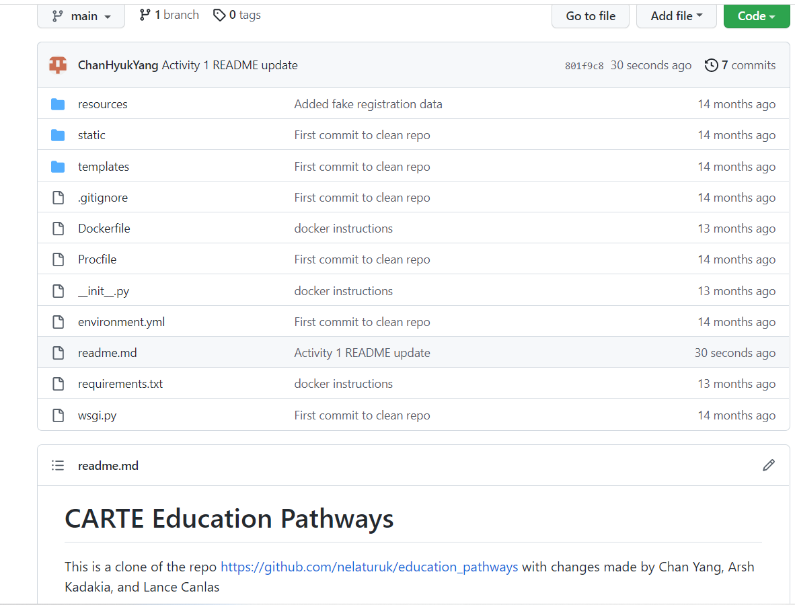
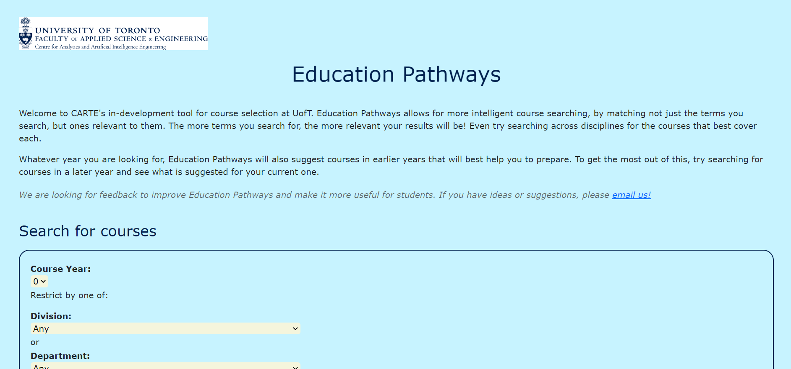
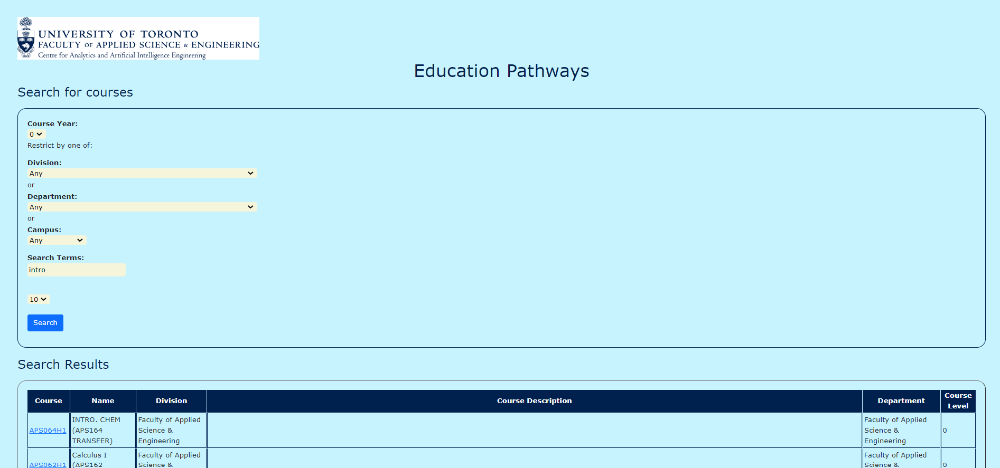

# CARTE Education Pathways

This is a clone of the repo https://github.com/nelaturuk/education_pathways with changes made by Chan Yang, Arsh Kadakia, and Lance Canlas

# Activity 1

# Activity 2-5
Home Pages Screenshot

Results Page – Form Screenshot

Results Page – Results Table Screenshot

# Activity 6
User Story 3.1.1: As a student, I want to learn if a course is required for a specific minor or certificate that I am interested in so that I can better prioritize these courses for the successful completion of my academic minor or certificate goals.

Acceptance criteria addressed: The user should be able to input a minor or certificate name and receive outputs for whether the course is required for all minors and certificates that match the name. 

User Story 3.2.1 - As a student, I want to see which courses can be useful in the pursuit of various career paths available post-graduation, so I can tailor my searches to these career goals

Acceptance criteria addressed: The user must be able to filter by career paths when it comes to course searches 

User Story 3.2.2 - As a student, being able to see courses grouped into central themes like machine learning, data science, system-on-chip (SOC) design, etc. would greatly help in planning out future enrollments suited to my needs

Acceptance criteria addressed: The user must be able to filter by central themes such as data science, SOC design, etc. when it comes to courses 

